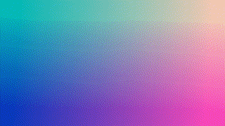

# Animation

Any value can be programmatically animated in a render loop. This example extends the simple [Hello GL](1.md) to add a `value` uniform that is passed in blue color component. `value` is animated over time.

```html
<AnimatedHelloGL width={256} height={180} />
```



## Implementation

```js
const React = require("react-native");
const GL = require("gl-react-native");

const shaders = GL.Shaders.create({
  helloGL: {
    frag: `
precision highp float;
varying vec2 uv;

uniform float value;

void main () {
  gl_FragColor = vec4(uv.x, uv.y, value, 1.0);
}
    `
  }
});

class HelloGL extends React.Component {
  constructor (props) {
    super(props);
    this.state = {
      value: 0
    };
  }
  componentDidMount () {
    const loop = time => {
      requestAnimationFrame(loop);
      this.setState({
        value: (1 + Math.cos(time / 1000)) / 2 // cycle between 0 and 1
      });
    };
    requestAnimationFrame(loop);
  }
  render () {
    const { width, height } = this.props;
    const { value } = this.state;
    return <GL.View
      shader={shaders.helloGL}
      width={width}
      height={height}
      uniforms={{ value }}
    />;
  }
}
```
